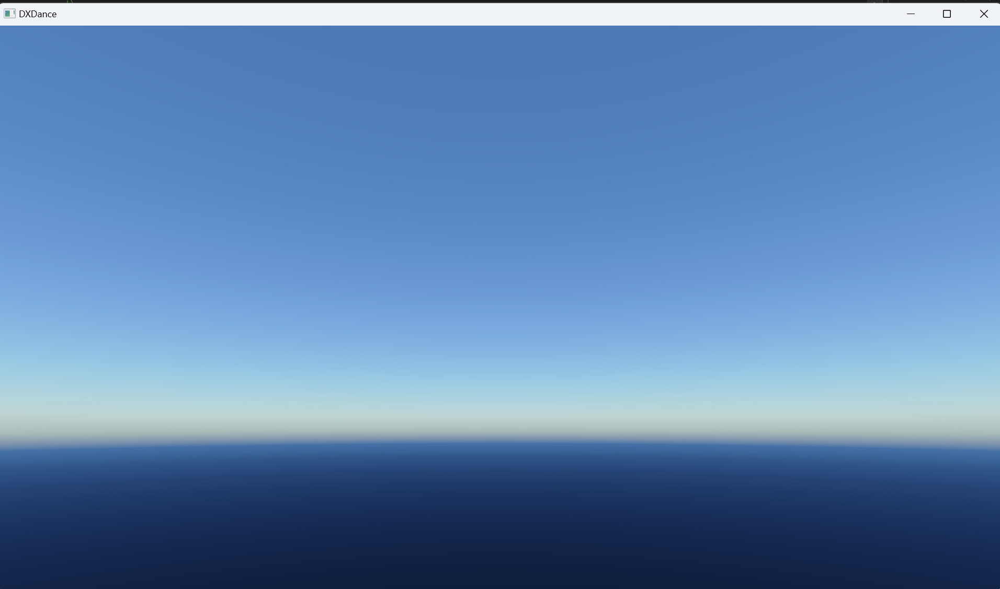

## 序

## 图形基础组件
以帧为概念进行资源的分配与回收，包括GPU资源（如共享内存），CPU资源（如LRU Cache）。

## RenderGraph与跨队列依赖
利用GPU的三大引擎（图形、计算和复制）并行多个RenderPass，提高GPU运行效率。RenderGraph构建时考虑了跨队列依赖问题，利用负权重的最短路径算法解决。

## ECS与简易地形碰撞
实现了ECS，并接入JobSystem来并行完成指定任务。地形碰撞通过Jolt实现，将8193 * 8193的HeightMap进行分割并保存为二进制文本数据，利用ECS根据摄像机所在位置读取一定范围内地形节点们对应的二进制文本数据，并实时创建HeightFieldBody，物理世界Step一次后回读数据即可。

## GPU-Driven Terrain QuadTree
利用GPU对地形四叉树进行分割，分割的依据有两个，其一是地形节点与摄像机的位置关系，其二是地形节点的四个子节点的HeightData是否被加载入显存中（由静态虚拟纹理控制）。整体渲染流程为TraverseQuadTree、BuildLodMap、BuildPatches、TerrainFeedbackPass和TerrainRenderPass。

## 静态虚拟纹理(SVT)
两种实现方案：第一种方案基于TextureAtlas，以HeightMap为例子，首先将HeightMap做Mipmap，生成8193 * 8193、4097 * 4097、2049 * 2049、1025 * 1025、513 * 513大小的MipLists，之后将它们按照65 * 65大小进行纹理切分，注意到两个相邻的纹理切片之间有1像素的重叠，然后将这些纹理切片按序列保存为二进制文本数据。显存中会创建一个1625 * 1625大小的TextureAtlas，能够缓存625个地形节点的高度纹理切片。
内存中则会创建一个拥有625个链表节点的LRU Cache与TextureAtlas中的每一个纹理切片一一对应。此外，程序中创建了一个子进程TerrainBackendThread，该子进程负责SVT的纹理切片的调度工作（因为调度工作涉及到磁盘IO），每当子进程检测到一个渲染帧被完成，则它创建一个新的上传帧，并在该上传帧内部执行调度工作，包括分配CPU资源（LRU Cache Node）、磁盘IO和录制CopyCommandList等。然后该子进程将录制完成的CopyCommandList放入一个线程安全的队列中供主渲染线程TryPop()，
从而保证多线程渲染的安全。当没有上传帧录制命令时，子进程会检测之前录制的上传帧是否完成，如若完成，则更新和回收分配的各种CPU资源。

另外一种方案基于D3D12 Reversed Resource + DirectStorage。D3D12 Reversed Resource类似于操作系统的虚拟内存，操作系统的虚拟内存是希望程序运行时只将该程序常用的内存数据映射到物理内存中，其余则存放在磁盘中，从而提高物理内存的使用率。D3D12 Reversed Resource则是希望将一个纹理常用的纹理切片映射到显存中，其余则放在磁盘中，提高显存利用率。DirectX12提供了CreateReservedResource函数，来创建一个保留资源，但仅仅是“声明”该资源，而不为其分配显存。后续程序员可以以Tile为单位，
将保留资源中的纹理切片映射到显存中。其中，一个Tile固定为65536Bytes，即64KB，映射可以通过UpdateTileMappings函数。以SplatMap为例子，其纹理宽高为8192 * 8192，单个纹素大小为4Bytes，不需要Mipmap操作，因此它所对应的Tile的宽高 == log2(65536/4)，即128 * 128。首先将SplatMap按照128 * 128大小进行纹理切分，两个相邻的纹理切片不需要像素重叠，然后将这些纹理切片按序列保存为二进制文本数据。然后，显存中，创建一个大小为32MB的显存堆，并将其等分为512份，每一份的大小都与保留资源的Tile大小一致，即65536(64KB)。
将此显存堆交由LRU Cache进行显存管理，管理粒度即为64KB。然后，额外创建一个预期显存尽可能大的保留资源，即SplatMapBackend。将此资源与显存堆做映射，这一步是为了与DirectStorage API做适配，该API提供的接口无法直接将磁盘中的TileData上传到显存堆，但是可以上传到ReversedResource的Tile中去。这一步并不会额外申请新的显存，只是做显存映射。运行时，根据摄像机的位置来判断当前需要流入SplatMap的哪些TileData，注意到判断范围是实际需要范围的四倍，因为SplatMap与实时虚拟纹理有关。全部的资源分配和命令录制代码都与TextureAtlas的实现一样嵌在TerrainBackendThread的单个上传帧内。

## 实时虚拟纹理(RVT)
程序希望近处地形渲染的最高精度为1m对应64texels，那么对于8192m * 8192m的地形而言，就需要宽高为512k * 512k的超巨大纹理，这显然无法预先烘焙出来并保存在磁盘中进行SVT调度。因此，需要使用到实时虚拟纹理技术(还可以减少混合平铺纹理的采样次数)。程序中设定RVT的生效范围是(-512m, 512m)，因此实际需要65536 * 65536大小的虚拟纹理来覆盖1024m * 1024m的范围。65536 * 65536是在最高精度的情况下，所需要的虚拟纹理大小。实际上在稍远处，不会需要如此高的渲染精度。因此，需要对虚拟纹理做mipmap操作，程序中做了从0到7总共8个mipcount。
在mipLevel == 7时，所需的虚拟纹理大小仅为512 * 512，渲染精度也只有0.5。mipmap之后，需要对虚拟纹理做纹理切分，程序中设定的纹理切片大小是256 * 256。为了管理这些切片的运行时状态，需要一个PageTable对象（CPU内存和GPU显存中各一份）。PageLevel == 0时，共有256 * 256个切片，这些切片对应到世界空间的矩形大小为4m * 4m，对应到纹理空间的矩形大小为256纹素 * 256纹素。缓存方面，程序在GPU显存上创建一个能暂存25 * 25个切片缓存的RVTAtlas，该图集的宽高为 6600(25 * 264)* 6600(25 * 264)。
264而不是256的原因是，像素在像素着色器中采样时，会对目标uv周围的纹素进行双线性插值操作。因此，在实际烘焙纹理切片时，需要将该切片对应在世界空间下的矩形块的邻近部分也纳入到烘焙范围内，并且该范围也与烘焙切片的PageLevel有关。调度方面，针对RVTAtlas创建了其对应的LRU Cache。与SVT的LRU Cache一致。由于每次都需要遍历FeedbackMap，从而生成实时烘焙切片的请求队列，而遍历FeedbackMap非常耗时，不能在主渲染线程中执行，因此程序中额外创建了一个新的线程RVTBackendThread来处理实时烘焙请求。
此外，由于渲染FeedbackMap的命令是由主渲染线程发出的，因此需要维护一个循环队列，主渲染线程负责向队列中生产FeedbackMap，而RVTBackendThread则每次都是检测到某个渲染帧完成后从循环队列中挑出Fresh标记为true的FeedbackMap进行处理。在RVTBackendThread录制完命令后，压入一个线程安全的队列中，主渲染线程TryPop该队列并向GPU压入命令。TODO处理RVTRectChangedEvent。

## 实时烘焙草点
首先将整个地形分为多个GrasslandNode，程序中设定的大小为64m * 64m，每个GrasslandNode中可以最多容纳512 * 512个草点，即GrassBlade。程序设定以摄像机为中心，GrassBlade的可见范围为256m * 256m，也就是16个GrasslandNode。由于每次实时烘焙GrassBlade太过耗时。因此，与前面的虚拟技术相同，在显存中创建GrassBladeLinearBuffer，并在CPU端创建对应的LRU Cache。一个GrassBladeLinearBuffer可以容纳32个GrasslandNode。如此一来，已经烘焙过一次的GrasslandNode，在某个时间段内便不再需要被烘焙，从而节省了GPU运行时间。与SVT和RVT不同的是，对于哪些GrasslandNode需要烘焙的逻辑判断直接被放置在主渲染线程中了，因为并不耗时。因此，LRU Cache的资源分配与回收是与渲染帧绑定的，而不是额外的上传帧。
PS:由于是很早之前写的，代码改了很多，现在此模块跑不起来了，演示图已不见。

## 大气渲染

## TAA

